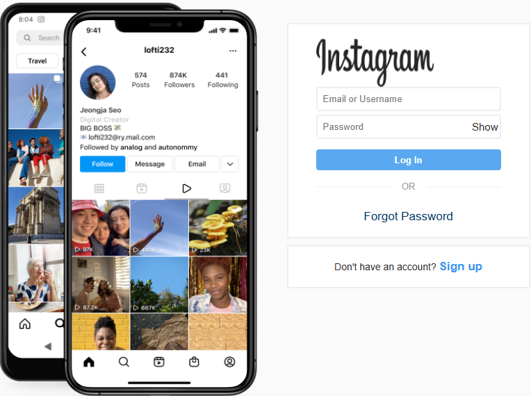
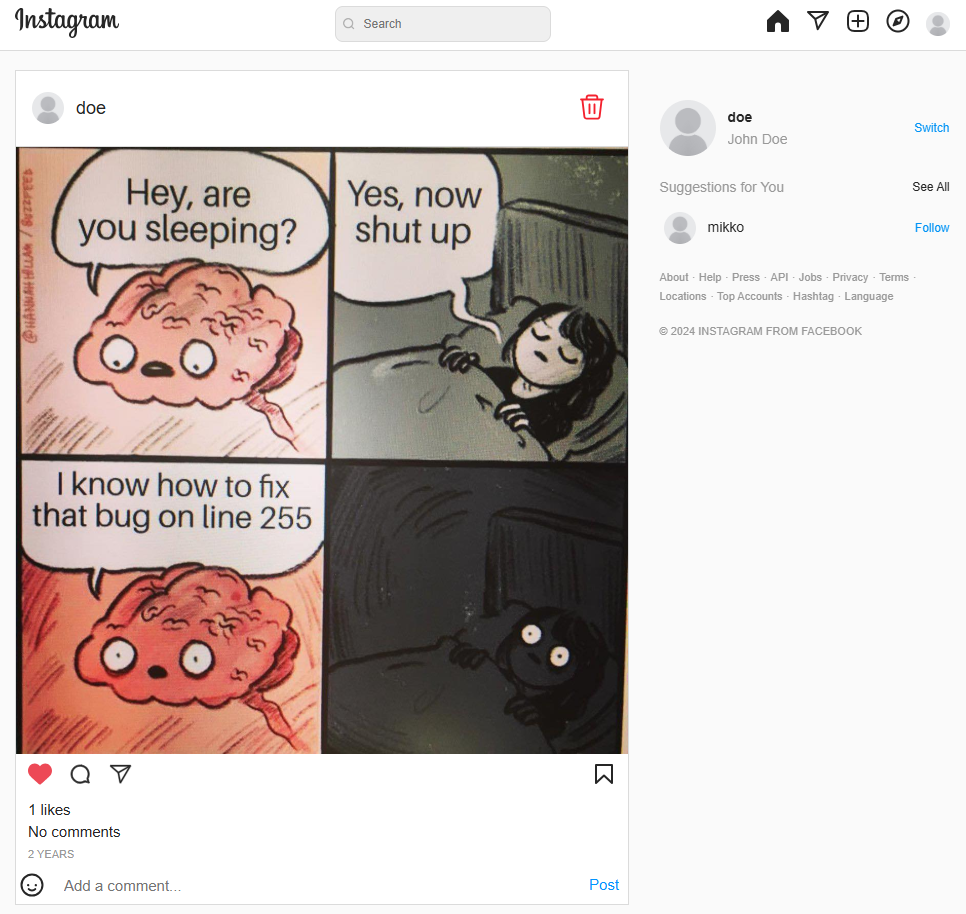
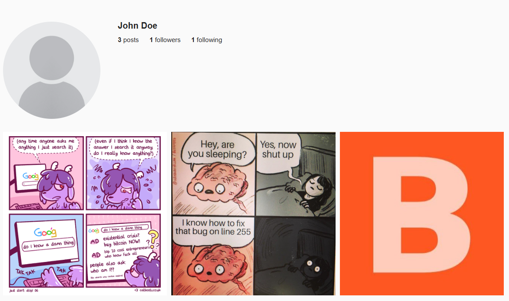

# Instagram Clone Project

This is a simple Instagram clone built using PHP and MySQL.

## Table of Contents
1. [Features](#features)
2. [Screenshots](#screenshots)
3. [Setup Instructions](#setup-instructions)
   - [Requirements](#requirements)
   - [Installation](#installation)
   - [Database Setup](#database-setup)
4. [Usage](#usage)
5. [License](#license)

---

## Features
- User registration and login
- Profile management
- Post creation with images
- Like functionality for posts
- User comments on posts

---

## Screenshots
Here are some screenshots of the Instagram clone:

*The login page.*

*The homepage showing all posts.*

*The user's profile page.*

---

## Setup Instructions

### Requirements
- MAMP (or a similar local server setup)
- PHP 7.x or higher
- MySQL database

### Installation
1. Clone the repository to your local machine.
2. Place the project folder inside the `htdocs` folder of MAMP.
3. Open MAMP and start the servers.
4. Access the project at `http://localhost/instagram/`.

### Database Setup
1. Open `phpMyAdmin` via `http://localhost/phpMyAdmin/`.
2. Create a new database named `instagram`.
3. Import the provided `instagram.sql` file (if included in your project) to set up the necessary tables.

---

## Usage
- Register an account, log in, and start interacting with posts.
- Upload images and manage your profile.

---

## License
This project is open source and available under the [MIT License](LICENSE).
